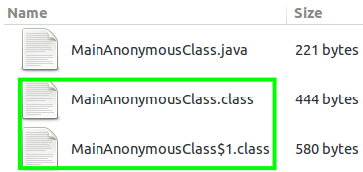
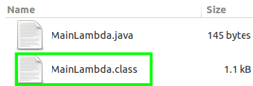

# Java的Lambda表达式机制

## Lambda表达式

*略将，应该会放到和$\lambda$演算一起去。

lambda表达式是一个匿名函数，也可称为闭包，它所抽象出来的东西是一组运算。

lambda表达式​允许把函数作为一个方法的参数（函数作为参数传递进方法中）。

使用lambda​表达式可以使代码变的更加简洁紧凑。

## Java里的Lambda表达式使用

Java 8的一个大亮点是引入lambda表达式，它显著增强了Java。首先，它们增加了新的语法元素，使Java语言的表达能力得以提升（更简洁，如用lambda语法来代替匿名的内部类），并流线化（stream）了一些常用结构的实现方式。其次，lambda表达式的加入也导致API 库中增加了新的功能，包括利用多核环境的并行处理功能（尤其是在处理`for-each`风格的操作时）变得更加容易，以及支持对数据执行管道操作的新的流API。*（第二点有点深入，值得研究一下，但下周有个有关Java的并行机制的报告）*

> Java 8 includes a couple of other parallel array operations that utilize lambda expressions outside of the streams framework. 
>
> Event-driven architectures are easy to implement using lambda-based callbacks.[4]

*当开发者在编写lambda​表达式时，也会随之被编译成一个函数式接口。

### 语法

lambda表达式在Java语言中引入了一个新的语法元素和操作符，这个操作符是`->`，称为lambda操作符或箭头操作符。用法如下：

```Java
(parameters) -> expression		// lambda体包含单独一个表达式（表达式体）
or
(parameters) -> {statements;}	// lambda体包含一个代码块（块体）
```

`->`将lambda表达式分为两个部分。左侧指定了lambda表达式需要的所有参数，右侧指定了lambda体，即lambda表达式要执行的动作。在用语言描述时，可以把`->`表达成“成了”或“进入”。

可作为参数传递lambda表达式。

也可以在lambda表达式中抛出异常，但是该异常必须与函数式接口的抽象方法的`throws`子句中列出的异常兼容。

### 例子

#### 表达式体

```Java
// before
double myMath() { return 123.45; }
// after
() -> 123.45		// 没有参数，参数列表为空，返回常量值123.45
// before
Integer add(Integer x, Integer y) { return x + y; }
// after
(x, y) -> x + y		// 类型推断
(Integer x, Integer y) -> x + y		// 指定类型
```

……

#### 作为参数传递lambda表达式

```Java
button.addActionListener(new ActionListener(){ // 匿名内部类
    public void actionPerformed(ActionEvent actionEvent){
        System.out.println("button detected");  
    }
});
button.addActionListener( 
    event -> System.out.println("button detected"));
```

……

#### 块体

Java 8能够将“一块代码”赋值给一个Java变量。在块lambda中必须显式使用`return`语句来返回值，因为块lambda体代表的不是单独一个表达式。

```Java
(int x, int y) -> { int max = x > y ? x : y;
                   return max;
                  }
```

……

### 变量捕获/变量作用域

在lambda表达式中，可以访问其外层作用域内定义的变量。

==lambda表达式可以获取或设置其外层类的实例或静态变量的值，以及调用其外层类定义的方法？==

对于lambda表达式外部作用域内定义的局部变量，lambda表达式只能引用标记了`final`或者隐性具有`final`语义(`effectively final`)的外部局部变量（放宽限制），即不能在lambda表达式内部修改定义在域外的局部变量。（`final`类型变量：只能赋值一次）

>The implication of being effectively final is that you can assign to the variable only
>once. 
>
>Encourage people to use lambda expressions to capture values rather than capturing variables.[4]

```Java
Callable<String> helloCallable(Stirng name){
    String hello = "Hello";
    return () -> (hello + ", " + name);
}
```

Lambda​表达式当中不允许声明一个与局部变量同名的参数或者局部变量。

因此，lambda表达式也常被称为闭包。变量捕获捕获的是值，而不是变量本身。

## Java里的lambda表达式机制

Lambda表达式看起来是对匿名内部类的一个简写，只要在编译阶段把所有的lambda表达式替换成匿名内部类就可以了。但实际并非如此，lambda表达式本质上是一个匿名方法，但这个方法不是独立执行的，而是用于实现由函数式接口(Functional Interfaces，是指内部只有一个抽象方法的接口)定义的另一个方法。因此，lambda表达式会导致产生一个匿名方法。

### 匿名内部类与lambda表达式

匿名内部类仍然是一个类，只是不需要程序员指定类名，编译器会自动为该类取名。

```Java
public class MainAnonymousClass {
	public static void main(String[] args) {
		new Thread(new Runnable(){
			@Override
			public void run(){
				System.out.println("Anonymous Class Thread run()");
			}
		}).start();;
	}
}
```

以上代码编译后会产生两个class文件，还会创建匿名内部类的对象。




Lambda表达式通过invokedynamic指令实现，书写lambda表达式不会产生新的类，而是被封装成主类的一个私有方法，并通过invokedynamic指令进行调用。

```Java
public class MainLambda {
	public static void main(String[] args) {
		new Thread(
				() -> System.out.println("Lambda Thread run()")
			).start();;
	}
}
```

以上代码编译后只有一个class文件：



作为扩展，在lambda表达式中，`this`关键字及其成员的应用和它们在lambda表达式之外的含义相同[6]。下面的代码将输出两遍`Hello Hoolee`，而如果是匿名内部类，将输出两个应用地址，比如`Hello$1@5b89a773` 和`Hello$2@537a7706`。

```Java
public class Hello {
	Runnable r1 = () -> { System.out.println(this); };
	Runnable r2 = () -> { System.out.println(toString()); };
	public static void main(String[] args) {
		new Hello().r1.run();
		new Hello().r2.run();
	}
	public String toString() { return "Hello Hoolee"; }
}
```

### 函数式接口

函数式接口是仅包含一个抽象方法的接口，通常表示单个动作。例如，标准接口`Runnable`是一个函数式接口，因为它只定义了一个方法`run()`，`run()`定义了`Runnable`的动作。

Java8引入函数式接口有它的原因：

1. **代码简洁**函数式编程写出的代码简洁且意图明确，使用*stream*接口让你从此告别*for*循环。
2. **多核友好**，Java函数式编程使得编写并行程序从未如此简单，你需要的全部就是调用一下`parallel()`方法。

```Java
// functional interface
@FunctionalInterface //可选，编译器会检查接口是否符合函数接口规范
public interface ConsumerInterface<T> {
    void accept(T t);
}

public interface Runnalbe{
    void run();
}
// before
Runnable runnable1 = new Runnable(){
    @Override 
    public void run(){  
        System.out.println("Running");
    }
};
// after
Runnable runnable2 = () -> System.out.println("Running");
// 稍微解释简化过程：public是多余的，函数名Runnalbe是多余的（接口名），方法名run是多余的（只有一个动作），返回类型void是多余的（接口里定义了，或者编译器自己判断），最后加上操作符"->"，完美。
```

下面通过例子来说明如何在参数上下文中使用lambda表达式。

```Java
// 定义一个函数式接口
interface MyNumber{
    double getValue();
}
// 声明对函数式接口MyNumber的一个引用
MyNumber myNum;
// 将一个lambda表达式赋值给该接口引用
myNum = () -> 123.45;
// lambda表达式变成了getValue()方法的实现
System.out.println(myNum.getValue());
```

当目标类型上下文中出现lambda表达式是，会自动创建实现了函数式接口的一个类的实例，函数式接口声明的抽象方法的行为由lambda表达式定义。当通过目标调用该方法时，就会执行lambda表达式。因此，**lambda表达式提供了一种将代码片段转换为对象的方法。**

### 泛型函数式接口

lambda表达式自身不能指定类型参数。因此，lambda表达式不能是泛型（当然，由于存在类型腿短，所有lambda表达式都展现出一些类似于泛型的特征）。然而，与lambda表达式关联的函数式接口可以是泛型。此时，lambda表达式的目标类型部分由声明函数式接口引用时指定的参数类型决定。*（下周有个有关Java的泛型机制的报告）*

```Java
// 定义一个泛型函数式接口
interface SomeFunc<T>{
    <T> func();
}
SomeFunc<String> s = () -> "This is a String";
SomeFunc<Integer> n = () -> 123.45;
```

### effectively final原因

尽管放宽了对捕获值的语法限制，但仍禁止捕获可变局部变量，这样有两个原因：

其一，Java 8语言的lambda表达式只实现了capture-by-value，也就是说它捕获的局部变量都会拷贝一份到lambda表达式的实体中，然后在lambda表达式里要变也只能变自己拷贝的那份，而无法影响外部原本的变量，所以Java语言的设计者就干脆禁止捕获可变局部变量。

其二，Java 8可以写出并行代码：

```Java
int sum = 0;
list.forEach(e -> {sum += e.size(); }); // ERROR

// use reduction
int sum = list.strem().mapToInt(e -> e.size()).sum();
int sum = list.stream().mapToInt(e -> e.size()).reduce(0, (x,y) -> x+y);
```

`forEach`是并行的，这样写的代码没有写竞争条件，让lambda体执行起来相当困难。除非我们愿意（最好是在编译时）强制执行这样一个函数而无法逃脱其捕获线程，否则此功能很可能会引起更多的麻烦。

> Unless we are willing to enforce -- preferably at compile time -- that such a function cannot escape its capturing thread, this feature may well cause more trouble than it solves. Lambda expressions close over *values*, not *variables*.

## 总结

在Java中，Lambda表达式有其相应的函数式接口，还有类型推断机制。

## 阅读资料

[1] Java 8编程参考官方教程（第9版）

[2] [深入理解Java函数式编程和Streams API](https://github.com/CarpenterLee/JavaLambdaInternals)

[3] [The Java® Language Specification](https://docs.oracle.com/javase/specs/jls/se8/html/index.html)

[4] Java 8 Lambdas, Richard Warburton

[5] Beginning Java 8 Language Features, Kishori Sharan

[6] http://cr.openjdk.java.net/~briangoetz/lambda/lambda-state-final.html

### 小阅读

[Java中的final和effectively final——csdn](https://blog.csdn.net/qing_gee/article/details/104306797)

[Java 8 Lambda 表达式——菜鸟教程](https://www.runoob.com/java/java8-lambda-expressions.html)